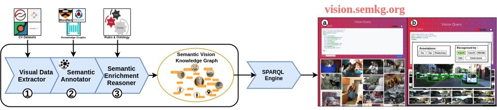

# VisionKG: Vision Knowledge Graph
Official Repository of [VisionKG](https://vision.semkg.org/) by

Anh Le-Tuan, Trung-Kien Tran, Manh Nguyen-Duc, Jicheng Yuan, Manfred Hauswirth and Danh Le-Phuoc. 
## About The Project
VisionKG is an RDF-based knowledge and built upon the FAIR principles. It provides a fatastic way to interlink and integrate data across different sources and spaces (e.g. MSCOCO, Visual_Genome, KITTI, ImageNet and so on) and brings a novel way to organize your data, explore the interpretability and explainability of models. By a few lines of SPARQL, you could query your desired number of images, objects from various built-in datasets and get their annotations via our Web API and build your models in a data-centric way.


<p align="center" width="100%">

</p>

<p align="center" width="80%">
The Overview of VisionKG
</p>

## [Demo for VisionKG](https://www.youtube.com/watch?v=Urs3wYtOgzs&t=21s): 

[](https://user-images.githubusercontent.com/87916250/139443459-e7346216-c720-4ad8-bcbd-0f202be4a6c4.mp4)

## Milestones:
In the future, VisionKG will integrated more and more triples, images, annotations, visual relationships and so on.
For the pre-trained models, besides the yolo series, now it also supports other one- or two-stage architectures such as EfficientDet, Faster-RCNN, and so on.
For more details, please check the infomation below.

|             | `Triples` | `Images` | `Annotations` |`Tasks` |`Datasets` |
|:-------------:|:-------:|:---------:|:---------:|:---------:|:---------:|
| **08.2021**   | 67M    | 239K      | 1M      | Object-Detection <br> Visual-Relationship | KITTI <br> MSCOCO <br> Visual-Genome |
| **10.2021** | 140M    | 13M      | 16M      | Image-Recognition | ImageNet |


✅ Faster-RCNN

✅ YOLO-Series

✅ EfficientDet

✅ RetinaNet

✅ FCOS

## Features

-   Query images / anotations across multi data sources using SPARQL
-   Online preview of the queried results
-   Graph-based exploration across visual label spaces
-   Interlinke and align labels under different labels spaces under shared semantic understanding 
-   Building training pipelines with mixed datasets
-   Cross-dataset validation and testing
-   Explore the interpretability and explainability of models

[Explore more about VisionKG →](https://vision.semkg.org/)

## Quick-View 

VisionKG can also be integrated into many famous toolboxes. 
For that, we also provides three pipelines for image recognition and obejct detection based on VisionKG and other toolboxes.

### Object Detection:

[VisionKG_meet_MMdetection →](https://colab.research.google.com/github/cqels/vision/blob/main/tutorials/tutorials_detection_mmdetection.ipynb)

[VisionKG_meet_Pytorch_model_Zoo →](https://colab.research.google.com/github/cqels/vision/blob/main/tutorials/tutorials_detection_pytorch_build_in_models.ipynb)

### Image Recognition:

[VisionKG_meet_timm →](https://colab.research.google.com/github/cqels/vision/blob/main/tutorials/tutorials_classification_timm.ipynb)

[VisionKG_meet_MMclassification →](https://colab.research.google.com/github/cqels/vision/blob/main/tutorials/tutorials_classification_mmclassification.ipynb)

## Acknowledgements

* [MMdetection](https://github.com/open-mmlab/mmdetection)
* [MMclassification](https://github.com/open-mmlab/mmclassification)
* [Pytorch](https://github.com/pytorch/pytorch)
* [timm](https://github.com/rwightman/pytorch-image-models)
* [torchvision](https://github.com/pytorch/vision)

## Citation

If you use VisionKG in your research, please cite our work.

```
@inproceedings{Kien:2021,
  title     = {Fantastic Data and How to Query Them},
  author    = {Trung, Kien-Tran and 
               Anh, Le-Tuan and Manh, Nguyen-Duc and Jicheng, Yuan and 
               Danh, Le-Phuoc},
  booktitle = {Proceedings of the {NeurIPS} 2021 Workshop on Data-Centric AI},
  series    = {Workshop Proceedings},
  year      = {2021}
}
```

```
@inproceedings{Anh:2021,
  title     = {VisionKG: Towards A Unified Vision Knowledge Graph},
  author    = {Anh, Le-Tuan and Manh, Nguyen-Duc and Jicheng, Yuan and 
               Trung, Kien-Tran and
               Manfred, Hauswirth and Danh, Le-Phuoc},
  booktitle = {Proceedings of the {ISWC} 2021 Posters & Demonstrations Track},
  series    = {Workshop Proceedings},
  year      = {2021}
}
```
