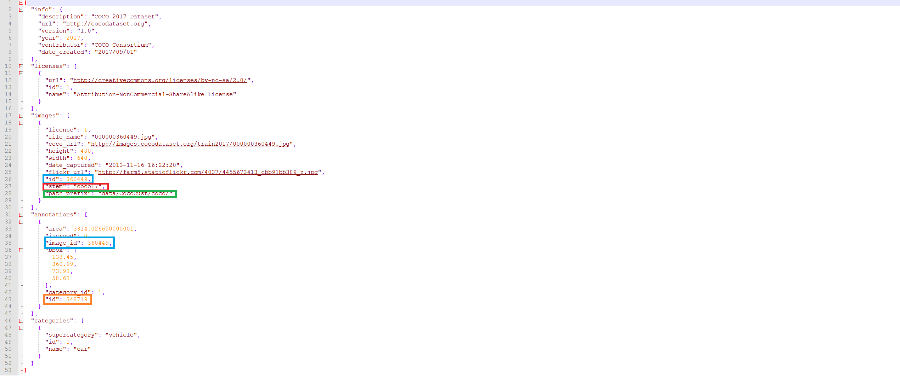

# Annotation-Example for our merged Dataset (MS-COCO-17 Standard)

## Brief-Intro

1) Here are 10 images and their annotations extraced as an example. (Two classes: car and truck) 

2) All the files are shown as below:
  
`--img_dir`: ./images/     
`--anno_dir_all`: ./annotaions/instances_annotaions_all.json     
`--anno_dir_single`: ./annotaions/instances_annotaions_single.json     

3) Some terms in the single-example-annotaion-file:

In the annotaions files: there are a list of keys:

`--info`: NOT need to be parsed during training and evalutation     
`--licenses`: NOT need to be parsed during training and evalutation     
`--images`: inlcuding images info (such as: height, width, url and id.) One addtional field has been added: **stem** (used to mark the source of this image)     
`--annotaions`: inlcuding annotaions info (such as segmentation polygon, groups of objects or not, image-id, bbox, bbox-id, category-id)     
`--categories`: inlcuding supercategory and mapping categories from integer to string         

***Note***

**I.** "id" in "images" should be same as "image_id" in "annotaions". (It indicates this bbox belongs to which image.)     

**II.** "id" in "annotaions" shows the no. of this bbox.     

***Additonal Keys***
**I.** "stem" in "images" indicates the source of this image. 

**I.** "path_prefix" in "images" indicates the path prefix of this image.
e.g. On our Server, it can be set as "path/to/coco/". (The model can load images from this path flexible.) 

Futher details about [MS COCO DATA FORMAT](https://cocodataset.org/#format-data).
